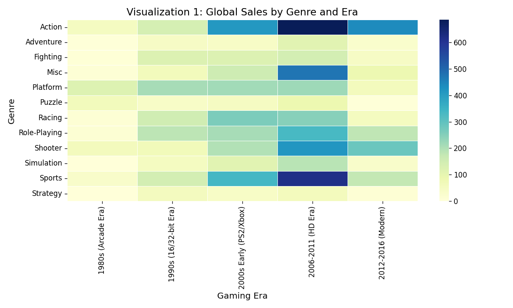
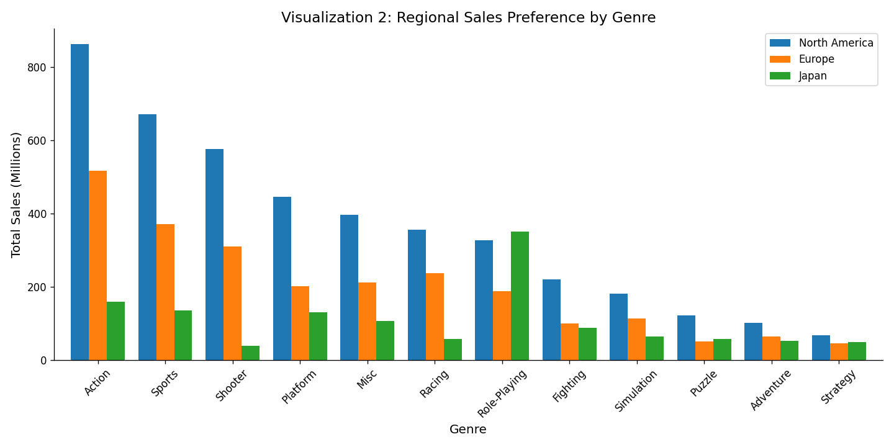
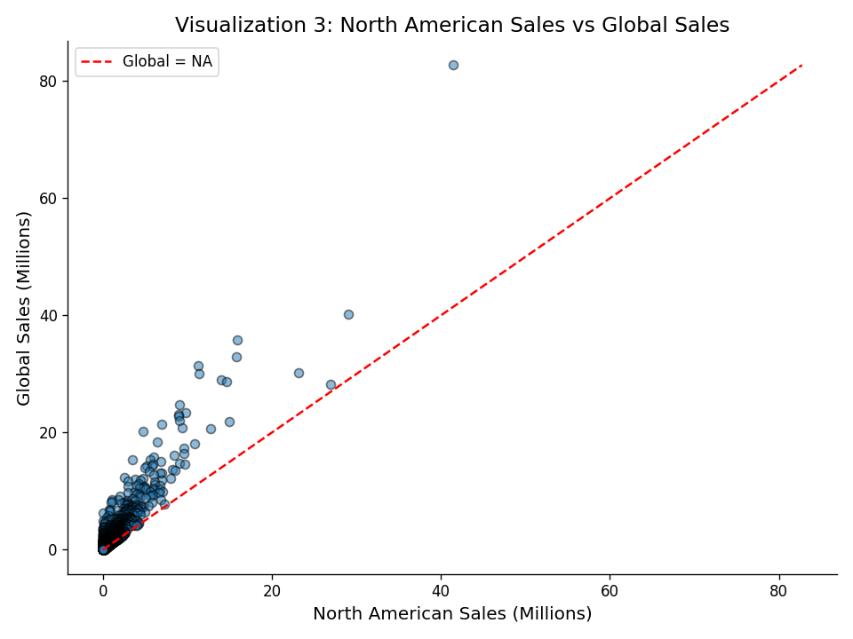
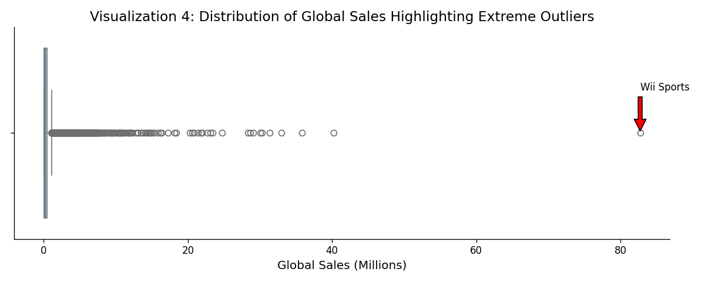

# Video Game Sales Market Analysis: Drivers of Commercial Success 🎮📈

[](https://www.python.org/)
[](https://pandas.pydata.org/)
[](https://matplotlib.org/)

## 🌟 Project Overview
This project performs a comprehensive data-driven investigation into the global video game industry. Analyzing a dataset of over **16,000 titles** released between 1980 and 2016, we uncover the critical factors that drive commercial success across different regions, genres, and eras.

### ❓ Analytical Questions
1. **Genre Evolution**: How has genre dominance shifted across gaming generations?
2. **Regional Variance**: How do preferences differ between North America (NA), Europe (EU), and Japan (JP)?
3. **Success Drivers**: What is the correlation between regional performance and global success?
4. **Market Anomalies**: What characterizes extreme outliers like *Wii Sports*?

---

## 🛠️ Methodology & Tools

### Tech Stack
- **Data Manipulation**: `Pandas`, `NumPy`
- **Visualization**: `Matplotlib`, `Seaborn`
- **Environment**: `Jupyter Notebook`, `python-dotenv`

### Data Cleaning Pipeline
1. **Handling Missing Values**: Dropped rows with null `Year` or `Publisher` (minimal impact: <2% data lost).
2. **Type Conversion**: Standardized years to integer format for temporal analysis.
3. **Deduplication**: Removed redundant entries based on Name and Platform.
4. **Normalization**: Stripped trailing whitespaces from categorical text data.
5. **Validation**: Filtered out records with zero global sales to ensure statistical relevance.

### Feature Engineering
- **Gaming Eras**: Grouped years into distinct generations (e.g., Arcade Era, 16-bit, HD Era, Modern).
- **Sales Tiers**: Categorized titles from *Micro* (<0.1M) to *Blockbuster* (>5M).
- **JP Dominance**: A binary flag identifying titles that outperformed in the Japanese market relative to NA.
- **NA Market Share**: Percentage-based metric to measure dependence on the North American market.

---

## 📊 Key Insights & Visualizations

### 1. The Rise of Action Games
The "Action" genre saw an explosive rise during the HD Era (2006-2011), eventually surpassing Platformers and RPGs as the primary revenue driver globally.


### 2. Regional Divergence
While North America and Europe share similar genre preferences (favoring Action and Sports), Japan shows a statistically significant preference for **Role-Playing Games**, which consistently rank higher than in western markets.


### 3. The "NA Success" Predictor
Correlation analysis reveals a **0.94 correlation coefficient** between NA sales and Global sales, suggesting that North American market reception is the strongest predictor of worldwide commercial viability.


### 4. Statistical Anomalies
*Wii Sports* stands as the single largest outlier in the history of the dataset with a **Z-score of 52.4**, largely attributed to its strategic bundling with the Wii hardware.


---

## 🚀 How to Run
1. **Clone the repository**:
   ```bash
   git clone https://github.com/MIHMahmudEli/Video-Game-Sales-Market-Analysis-Drivers-of-Commercial-Success.git
   cd Video-Game-Sales-Market-Analysis-Drivers-of-Commercial-Success
   ```
2. **Install dependencies**:
   ```bash
   pip install -r requirements.txt
   ```
3. **Execute Analysis**:
   Open `Video_Game_Sales_Analysis.ipynb` in your preferred Jupyter environment and run all cells.

---

## ⚠️ Limitations & Future Work
- **Temporal Constraint**: The dataset ends in 2016, missing the recent growth of the Nintendo Switch and current-gen consoles (PS5/Xbox Series).
- **Distribution Mediums**: The data primarily tracks physical retail sales. Future iterations should incorporate digital storefront data (Steam, PSN, Xbox Live).
- **Mobile Gaming**: Mobile revenue, which now dominates the industry, is not captured in this dataset.

## 👤 Author
**Mohsin Ibna Hossain**
Student ID: 23-50194-1
American International University-Bangladesh (AIUB)

---
*This project was developed as part of the Python for Data Analysis Final Project.*
